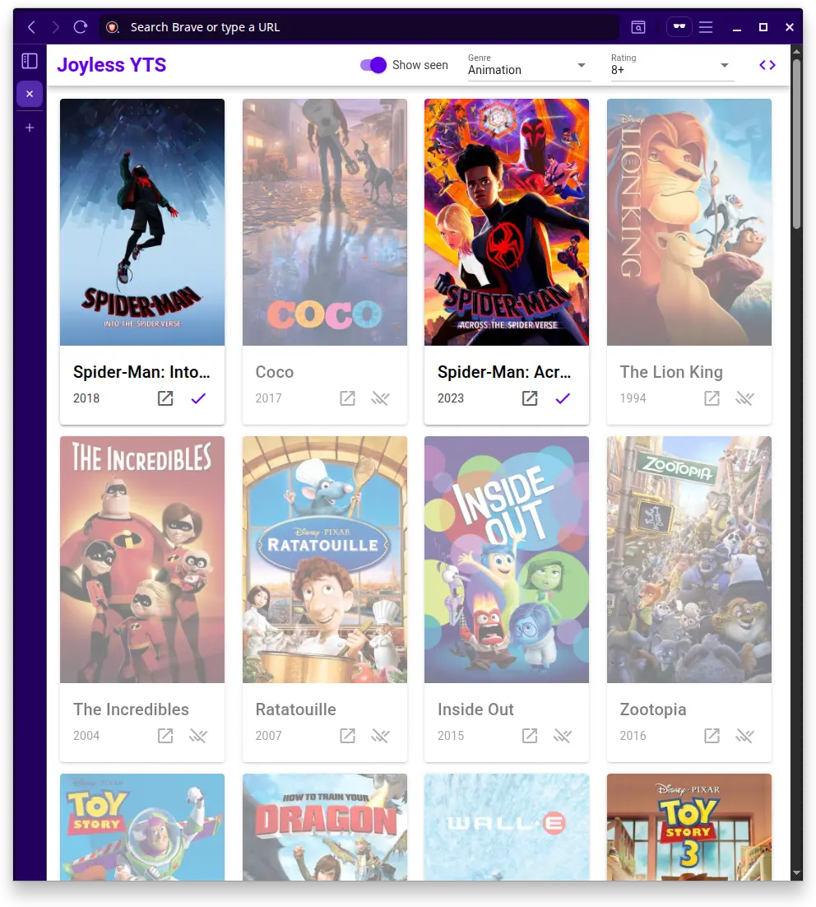

# Joyless YTS: Yet To See

Live: https://joyless-yts.netlify.app

**Features:**

- Filter by **Genre** and **Minimum Rating**.

- Automatically sort by downloads count.

- "Show hidden movies" toggle.




## Usage

### Generating the filter

```sh
# Using sample data
npm run generate-filter

# Using joyless.things.json
npm run generate-filter -- --source json
```


## Problem

Discovering stuff I have yet to see.

## Idea: Cuckoo filter

A Cuckoo filter is like a probabilistic set. It answers the question "Is this element in the set?" with either **No** (certain) or **Probably Yes**. \
Meaning, there may be false positives. \
For our use-case, we can set adjust the error rate (**false positive rate**) to 1%. \
Plus, this is a non-critical app, so false positives are fine. In the worst case scenario, we simply hide a great movie that should've been shown. \
In a more serious scenario, we might need to double check the database to be certain, or just not use probabilistic data structures altogether.

### Example

Our set is the list of movies I have already watched. Suppose they are exported my IMDb's account.

Now, we can ask questions like:

Have I seen [_One Flew Over the Cuckoo's Nest_](https://www.imdb.com/title/tt0073486/)? Probably yes. Hide it.

Have I seen [_The Godfather_](https://www.imdb.com/title/tt0068646/)? Certainly no. Display it. I want to watch it.


## Implementation

- [`npm:bloom-filters`](https://github.com/Callidon/bloom-filters) provies the Bloom and Cuckoo filters.
  * [`npm:buffer`](https://github.com/feross/buffer) to polyfill `Buffer` in the browser.
  * 🟥 As of 2025-10-05, Cuckoo filter is bugged: It returns false negatives, which is unacceptable.
    We will need to [wait for the issue to be fixed](https://github.com/Callidon/bloom-filters/issues/68) or use something else.
  * 🟩 Supports JSON serialization.
  * 🟩 Uses xxHash.
- [ ] [`npm:cuckoo-filter`](https://github.com/vijayee/cuckoo-filter)
  * 🟩 Supports JSON serialization.
  * 🟧 Not maintained.
  * 🟧 Uses DJB2 Hash (the `hash` util function) and FNV Hash (specifically FNV-1a from `npm:fnv32`).
     In theory, FNV is less random and less uniform than xxHash. That could lead to more collisions and false positives in a Bloom/Cuckoo filter.

- [YTS API](https://yts.mx/api) to list movies.
- [ ] TMDb API

- Vue

- ~~[Reka UI](https://github.com/unovue/reka-ui)~~ 
  * Think: Radix UI for Vue.

- Quasar Framework


## Possible questions

- Why YTS?
Simple API, requires no access token.


## License

WTFPL
